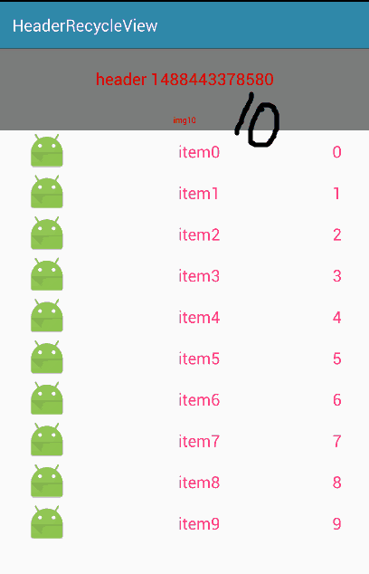

2017-03-02 16:10 发布于 h t t p : / / git.oschina.net/vigiles/HeaderRecycleView <br/>

 

可以添加header，也可以不添加。
添加了，可以下拉刷新header。

## 核心在Adapter
``` xml

  www.gaohaiyan.com <br/>
  类的说明：添加了header的recycleview的适配器<br/>
  可以下拉刷新header，<br/>
  查看TODO，修改必须的数据，包括：<br/>
  <li>1.构造函数指定 VG、Ctx、普通item的数据集合
  <li>2.初始化header布局
  <li>3.指定普通item的布局，并初始化对应的 VIEW HOLDER
  <li>4.绑定普通item的布局到HOLDER
  <li>5.关联普通item的数据
  <li>6.setHeaderView方法传入的header封装体数据化header布局
 
```
具体代码：
``` java
public class HeaderRcyvAdapter extends RecyclerView.Adapter<RecyclerView.ViewHolder> {

	public static final int TYPE_HEADER = 0;  //说明是带有Header的
	public static final int TYPE_NORMAL = 1;  //说明是不带有header的

	private List<NormalBean> mDatas;
	private View headerView;

	/**
	 * TODO 1.传入RecycleView、上下文、普通item的数据集
	 * @param list
	 */
	public HeaderRcyvAdapter(Context ctx, List<NormalBean> list) {
		this.mDatas = list;
	}

	/**
	 * 每次刷新数据都调用<br/>
	 * TODO 6.setHeaderView方法传入的header封装体数据化header布局
	 * @param bean header数据封装体
	 * */
	public void setHeaderView(ViewGroup parent, HeaderBean bean){
		// TODO 2.初始化header的布局
		if(null == headerView)
			headerView = LayoutInflater.from(parent.getContext()).inflate(R.layout.ghy_hrcyv_header, parent, false);

		((TextView)headerView.findViewById(R.id.title)).setText(bean.title);
		((TextView)headerView.findViewById(R.id.note)).setText(bean.note);

		notifyItemInserted(0);
	}

	/**
	 * 重写这个方法，很重要，是加入Header 我们通过判断item的类型，从而绑定不同的view
	 */
	@Override
	public int getItemViewType(int position) {
		if (headerView == null) {
			return TYPE_NORMAL;
		}

		if (position == 0) { // 既然执行到这里，那么就是有header的。次数第一个item加载Header
			return TYPE_HEADER;
		}

		return TYPE_NORMAL;
	}

	//创建View，如果是HeaderView直接在Holder中返回
	@Override
	public RecyclerView.ViewHolder onCreateViewHolder(ViewGroup parent, int viewType) {
		if (headerView != null && viewType == TYPE_HEADER) {
			return new ViewNormalHolder(headerView);
		}

		// TODO 3.指定普通item的布局，并初始化对应的 VIEW HOLDER
		View layout = LayoutInflater.from(parent.getContext()).inflate(R.layout.ghy_hrcyv_item, parent, false);
		return new ViewNormalHolder(layout);
	}

	// 根据返回的这个position的类型进行绑定，HeaderView不用绑定
	@Override
	public void onBindViewHolder(RecyclerView.ViewHolder holder, int position) {
		if (getItemViewType(position) == TYPE_NORMAL) {
			if (holder instanceof ViewNormalHolder) {
				int index;
				if(null == headerView){
					index = position;
				} else {
					index = position - 1;
				}

				// TODO 5.关联普通item的数据
				((ViewNormalHolder) holder).tv.setText(mDatas.get(index).text);
				((ViewNormalHolder) holder).fg.setText(mDatas.get(index).flag);

				return;
			}
			return;
		} else if (getItemViewType(position) == TYPE_HEADER) {
			return;
		} else {
			return;
		}
	}

	// 列表中item总数应该是ListView中Item的个数加上HeaderView
	@Override
	public int getItemCount() {
		if (headerView == null ) {
			return mDatas.size();
		} else if (headerView != null ) {
			return mDatas.size() + 1;
		} else {
			return mDatas.size();
		}
	}

	/** 普通item的控制器
	 * */
	class ViewNormalHolder extends RecyclerView.ViewHolder {

		public TextView tv;
		public TextView fg;

		public ViewNormalHolder(View itemView) {
			super(itemView);

			if (itemView == headerView) { //如果是headerview
				return;
			}

			// TODO 4.绑定普通item的布局到HOLDER
			tv = (TextView) itemView.findViewById(R.id.item);
			fg = (TextView) itemView.findViewById(R.id.flag);
		}
	}
}
```

## 使用
``` java
		// 1.准备数据
		initData();

		// 2.定义适配器
		mHeaderRcyvAdapter = new HeaderRcyvAdapter(this, mNormalList);

		// 3.定义列表控件并指定适配器
		mRecyclerView = (RecyclerView)findViewById(R.id.mRecyclerView);
		mRecyclerView.setLayoutManager(new LinearLayoutManager(this));
		mRecyclerView.setAdapter(mHeaderRcyvAdapter);

		// 4.指定header TODO 如果不需要header，则关闭这一句，及下拉刷新的同一语句
		mHeaderRcyvAdapter.setHeaderView(mRecyclerView, mHeaderBean);

		mSwipeRefresh = (SwipeRefreshLayout) findViewById(R.id.mSwipeRefresh);
		mSwipeRefresh.setOnRefreshListener(new SwipeRefreshLayout.OnRefreshListener() {
			@Override
			public void onRefresh() {
				initData();

				mSwipeRefresh.setRefreshing(false);
				mHeaderRcyvAdapter.notifyDataSetChanged(); // 刷新普通item

				// 5.数据改变后，刷新header TODO 如果不需要header，则关闭这一句
				mHeaderRcyvAdapter.setHeaderView(mRecyclerView, mHeaderBean);
			}
		});
```
<hr/>

[http://www.gaohaiyan.com](http://www.gaohaiyan.com) <br/>
